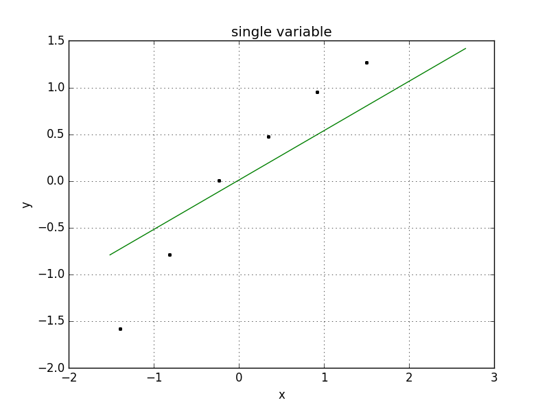

# machine-learning-notes

## Linear Regression
#### Simple Linear Regression
<table> <tbody> <tr> <td align="left" width=350>
</a></td>
<td align="left" width=450> 
<a href="code/simple_linear_regression.py">code</a> 
* reference：
<a href="https://zh.wikipedia.org/wiki/%E6%9C%80%E5%B0%8F%E4%BA%8C%E4%B9%98%E6%B3%95">least square regression(最小二乘法)</a>, 
<a href="https://www.jianshu.com/p/fcd220697182">一元线性回归的细节</a>, 
<a href="https://www.geeksforgeeks.org/linear-regression-python-implementation/">一元线性回归</a>
</td></tr></tbody></table>

#### Multiple linear regression
* [code](code/multiple_linear_regression.py)

#### Polynomial regression(多项式回归)

<table> <tbody> <tr> <td align="left" width=350>
</a></td>
<td align="left" width=450> 
<a href="code/polynomial_regression.py">code</a> 
* reference：
<a href="https://www.jianshu.com/p/cf2b391a3c95">扩展具有基函数的线性模型, 跟线性模型是同一类</a>, 
<pre><code>
[@CentOS ~]# python code/polynomial_regression.py
Coefficients: [  0.00000000e+00   3.26162199e-02   2.11341000e-05]
intercept: 177.607131202
score: %.3f 0.77180187392
</pre></code>
</td></tr></tbody></table>

## 机器学习教程 Scikit-learn 
以下代码代码来至blog [SharEDITor](www.shareditor.com) 网址: www.shareditor.com

#### 一元线性回归
[code](code/scikit_learn_linear_model_demo.py)
<pre><code>
	import numpy as np
	from sklearn.linear_model import LinearRegression

	x = [[1],[2],[3],[4],[5],[6]]
	y = [[1],[2.1],[2.9],[4.2],[5.1],[5.8]]
	model = LinearRegression()
	model.fit(x, y)

	print("系数: ", model.coef_)
	print("截距: ", model.intercept_)
	print("回归函数：y = x * ", str(model.coef_[0][0]), " + ", str(model.intercept_[0]))
	predicted = model.predict([13])[0]
	print("x = 13 的预测值： ",predicted[0])

</pre></code>
* 画图
<table> <tbody> <tr> <td align="left" width=350>
</a></td>
<td align="left" width=450>
<pre><code>
import numpy as np
from sklearn.linear_model import LinearRegression
import matplotlib.pyplot as plt
from matplotlib.font_manager import FontProperties

x = [[1],[2],[3],[4],[5],[6]]
y = [[1],[2.1],[2.9],[4.2],[5.1],[5.8]]
model = LinearRegression()
model.fit(x, y)
x2 = [[0], [2.5], [5.3], [9.1]]
y2 = model.predict(x2)

plt.figure()
plt.title('linear sample')
plt.xlabel('x')
plt.ylabel('y')
plt.axis([0, 10, 0, 10])
plt.grid(True)
plt.plot(x, y, 'k.')
plt.plot(x2, y2, 'g-')
plt.show()
</pre></code>
</td></tr></tbody></table>

#### 多元线性回归模型 [code](code/scikit_learn_multvariable_linear_model_demo.py)
<table> <tbody> <tr><td align="left" width=400>
用numpy的最小二乘函数计算 
 
 
<pre><code>
    from numpy.linalg import lstsq
    #使用numpy的最小二乘函数直接计算出β
    X = [[1,1,1],[1,1,2],[1,2,1]]
    y = [[6],[9],[8]]

    print(lstsq(X, y)[0])
</pre></code>
</td>
<td align="left" width=400>
用scikit-learn求解多元线性回归
<pre><code>

    from sklearn.linear_model import LinearRegression

    X = [[1,1,1],[1,1,2],[1,2,1]]
    y = [[6],[9],[8]]

    model = LinearRegression()
    model.fit(X, y)
    x2 = [[1,3,5]]
    y2 = model.predict(x2)
    print(y2)
</pre></code>
</td></tr></tbody></table>

#### 梯度下降法
线性回归模型计算量会非常大,随机梯度下降法用一个样本调整参数，逐渐逼近，效率高[code](code/scikit_learn_sgd_regressor.py)
<table> <tbody> <tr> <td align="left" width=350>
</a></td>
<td align="left" width=450>
<pre><code>
# coding:utf-8
#from: http://www.shareditor.com/blogshow?blogId=57

import matplotlib.pyplot as plt
from sklearn.linear_model import SGDRegressor
from sklearn.preprocessing import StandardScaler

plt.figure() # 实例化作图变量
plt.title('single variable') # 图像标题
plt.xlabel('x') # x轴文本
plt.ylabel('y') # y轴文本
plt.grid(True) # 是否绘制网格线

X_scaler = StandardScaler()
y_scaler = StandardScaler()
X = [[50],[100],[150],[200],[250],[300]]
y = [[150],[200],[250],[280],[310],[330]]

X = X_scaler.fit_transform(X)
y = y_scaler.fit_transform(y)
X_test = [[40],[400]] # 用来做最终效果测试
X_test = X_scaler.transform(X_test)

plt.plot(X, y, 'k.')

model = SGDRegressor()
model.fit(X, y.ravel())
y_result = model.predict(X_test)
plt.plot(X_test, y_result, 'g-')

plt.show()
</pre></code>
</td></tr></tbody></table>

#### K-means(k-平均或k-均值)算法 
一种得到最广泛使用的聚类算法,[k-means算法的性能分析](https://wizardforcel.gitbooks.io/dm-algo-top10/content/k-means.html)
* 试验 
[图](images/scikit_learn_k_means.png)
<table> <tbody> <tr> <td align="left" width=550>
</a>
</td></tr></tbody></table>

[code](code/scikit_learn_k_means.py)
<pre><code>

import matplotlib.pyplot as plt
import numpy as np

cluster1 = np.random.uniform(0.5, 1.5, (2, 10))#生成2*10的矩阵，且值均匀分布的随机数
cluster2 = np.random.uniform(3.5, 4.5, (2, 10))
'''
顺序连接两个矩阵，形成一个新矩阵,所以生成了一个2*20的矩阵
做转置后变成20*2的矩阵,刚好是一堆(x,y)的坐标点
'''
X = np.hstack((cluster1, cluster2)).T

plt.figure()
plt.axis([0, 5, 0, 5])
plt.grid(True)
plt.plot(X[:,0],X[:,1],'k.')

from sklearn.cluster import KMeans
kmeans = KMeans(n_clusters=2)
kmeans.fit(X)

print("The first center: ",kmeans.cluster_centers_[0,:])
print("The second center: ", kmeans.cluster_centers_[1,:])

plt.plot(kmeans.cluster_centers_[:,0],
         kmeans.cluster_centers_[:,1], 'ro')

plt.show()

</pre></code>

* 肘部法则 
[图](images/scikit_learn_k_means_2.png)
<table> <tbody> <tr> <td align="left" width=550>
</a>
</td></tr></tbody></table>

[code](code/scikit_learn_k_means_2.py)
<pre><code>

import matplotlib.pyplot as plt
import numpy as np
from sklearn.cluster import KMeans
from scipy.spatial.distance import cdist

'''
生成2*10的矩阵，且值均匀分布的随机数
'''
cluster1 = np.random.uniform(0.5, 1.5, (2, 10))
cluster2 = np.random.uniform(1.5, 2.5, (2, 10))
cluster3 = np.random.uniform(1.5, 3.5, (2, 10))
cluster4 = np.random.uniform(3.5, 4.5, (2, 10))

'''
顺序连接两个矩阵，形成一个新矩阵,所以生成了一个2*20的矩阵，
T做转置后变成20*2的矩阵,刚好是一堆(x,y)的坐标点
'''
X1 = np.hstack((cluster1, cluster2))
X2 = np.hstack((cluster3, cluster4))
X = np.hstack((X1, X2)).T #40 * 2 矩阵

K = range(1, 10)
meandistortions = []
for k in K:
    kmeans = KMeans(n_clusters=k)
    kmeans.fit(X) # 求kmeans的成本函数值
    meandistortions.append(sum(np.min(cdist(X,
	kmeans.cluster_centers_, 'euclidean'), axis=1)) / X.shape[0])

plt.figure()
plt.grid(True)

plt.rcParams['font.sans-serif']=['SimHei'] ##解决画图中文乱码问题 用来正常显示中文标签
plt.rcParams['axes.unicode_minus']=False #用来正常显示负号

plt1 = plt.subplot(4,1,1)

plt1.plot(X[:,0],X[:,1],'k.') # 画样本点
plt1.set_title('样本点')
plt1.legend()

plt2 = plt.subplot(4,1,2)

plt2.plot(K, meandistortions, 'bx-')# 画成本函数值曲线
plt2.set_title('成本函数曲线')
plt2.legend()

k = 4 # 将数据分成4簇
kmeans = KMeans(n_clusters=k) 
kmeans.fit(X)

'''
print(type(kmeans.cluster_centers_))
print(kmeans.cluster_centers_)
print(kmeans.labels_ )
'''

plt3 = plt.subplot(4,1,3)# 将4簇用不同的颜色标记
plt3.scatter(X[:, 0], X[:, 1], c=kmeans.labels_)
plt3.set_title("区分不同簇的点")
plt3.legend()

plt4 = plt.subplot(4,1,4)# 画出每一簇的中心点
plt4.plot(X[:,0],X[:,1],'k.')
plt4.plot(kmeans.cluster_centers_[:,0],
         kmeans.cluster_centers_[:,1], 'ro')

plt4.set_title("各簇中心点") #label doesn't work if you forgot to display the legend

plt4.legend()
plt.show()
</pre></code>

#### matplotlib绘图
##### 绘制多轴图
<table> <tbody> <tr> <td align="left" width=350>
</a></td>
<td align="left" width=450> 
<a href="code/matplotlib_multi_axis.py">code</a> 
<pre><code>

#From: http://www.shareditor.com/blogshow?blogId=55
import matplotlib.pyplot as plt
import numpy as np

def draw(plt):
    plt.axis([-12, 12, -1, 1]
    plt.grid(True)
    xx = np.linspace(-12, 12, 1000)
    plt.plot(xx, np.sin(xx), 'g-', label="$sin(x)$")
    plt.plot(xx, np.cos(xx), 'r--', label="$cos(x)$")
    plt.legend()
plt.figure()
plt1 = plt.subplot(2,2,1)
draw(plt1)
plt2 = plt.subplot(2,2,2)
draw(plt2)
plt3 = plt.subplot(2,2,3)
draw(plt3)
plt4 = plt.subplot(2,2,4)
draw(plt4)
plt.show()
</pre></code>
</td></tr></tbody></table>

##### 绘制3D散点图
<table> <tbody> <tr> <td align="left" width=350>
</a></td>
<td align="left" width=450> 
<a href="code/matplotlib_plot_3d_scatter.py">code</a> 
<pre><code>
#from: http://www.shareditor.com/blogshow?blogId=55

from mpl_toolkits.mplot3d import Axes3D
import numpy as np
import matplotlib.pyplot as plt

fig = plt.figure()
ax = fig.add_subplot(1,1,1,projection='3d')
xx = np.linspace(0, 5, 10)
yy = np.linspace(0, 5, 10)
zz1 = xx
zz2 = 2*xx
zz3 = 3*xx
ax.scatter(xx, yy, zz1, c='red', marker='o')
ax.scatter(xx, yy, zz2, c='green', marker='^')
ax.scatter(xx, yy, zz3, c='black', marker='*')
ax.legend()

plt.show()
</pre></code>
</td></tr></tbody></table>

##### 绘制3D表面
<table> <tbody> <tr> <td align="left" width=350>
</a></td>
<td align="left" width=450> 
<a href="code/matplotlib_plot_3d_surface.py">code</a> 
<pre><code>
# coding:utf-8
#from: http://www.shareditor.com/blogshow?blogId=55

from mpl_toolkits.mplot3d import Axes3D
from matplotlib import cm
from matplotlib.ticker import LinearLocator,\
FormatStrFormatter
import matplotlib.pyplot as plt
import numpy as np

fig = plt.figure()
ax = fig.gca(projection='3d')

X = np.arange(-5, 5, 0.25)
Y = np.arange(-5, 5, 0.25)
X, Y = np.meshgrid(X, Y)

Z = X**2+Y**2

ax.plot_surface(X, Y, Z, rstride=1,\
 cstride=1, cmap=cm.coolwarm, linewidth=0,\
 antialiased=False)

plt.show()
</pre></code>
</td></tr></tbody></table>

##### 画竖直和水平分割线
<table> <tbody> 
<tr> <td align="left" width=350>
</a></td>
<td align="left" width=450> 
画水平分割线 <a href="code/matplotlib_plot_vlines_and_hline.py">code</a> 
<pre><code>
# coding:utf-8
'''
#From：https://www.zhihu.com/question/21929761/answer/164975814
'''
import matplotlib.pyplot as plt
import numpy as np
def Laplacian_Prior(x, u, b):
    return 1.0/(2*b)*np.exp(-abs(x - u)/b)
if __name__ == "__main__":
    x = np.arange(-10, 10, 0.01)
    y_1 = Laplacian_Prior(x, 0, 1)
    y_2 = Laplacian_Prior(x, 0, 2)
    y_3 = Laplacian_Prior(x, 0, 4)
    y_4 = Laplacian_Prior(x, -5, 4)
    plt.plot(x, y_1, "r-")
    plt.plot(x, y_2, "k-")
    plt.plot(x, y_3, "b-")
    plt.plot(x, y_4, "g-")
    # plt.vlines(0, 0, 0.5, colors = "c", linestyles = "dashed")
    plt.hlines(0.3, -10, 10, colors = "c", linestyles = "dashed")
    plt.show()
</pre></code>
</td></tr>
<tr> <td align="left" width=350>
</a></td>
<td align="left" width=450> 
画竖直分割线 <a href="code/matplotlib_plot_vlines_and_hline.py">code</a> 
<pre><code>
# coding:utf-8
'''
#From：https://www.zhihu.com/question/21929761/answer/164975814
'''
import matplotlib.pyplot as plt
import numpy as np
def Laplacian_Prior(x, u, b):
    return 1.0/(2*b)*np.exp(-abs(x - u)/b)
if __name__ == "__main__":
    x = np.arange(-10, 10, 0.01)
    y_1 = Laplacian_Prior(x, 0, 1)
    y_2 = Laplacian_Prior(x, 0, 2)
    y_3 = Laplacian_Prior(x, 0, 4)
    y_4 = Laplacian_Prior(x, -5, 4)
    plt.plot(x, y_1, "r-")
    plt.plot(x, y_2, "k-")
    plt.plot(x, y_3, "b-")
    plt.plot(x, y_4, "g-")
    plt.vlines(0, 0, 0.5, colors = "c", linestyles = "dashed")
    #plt.hlines(0.3, -10, 10, colors = "c", linestyles = "dashed")
    plt.show()
</pre></code>
</td></tr>
</tbody></table>

#### Pandas使用
<table> <tbody> <tr> <td align="left" width=350>
</a></td>
<td align="left" width=450> 
<a href="code/test_pandas.py">code</a> 
<pre><code>

'''
Using pandas to quickly plot graphs
'''
df.plot(x='year', y=['rain_octsep', 'outflow_decfeb'])

plt.show()

</pre></code>
</td></tr></tbody></table>

## Python 数据科学类库

### 数据科学库
NumPy、SciPy、Pandas 是 Python 数据科学的核心类库。
* NumPy  
提供了 N 维数组、矩阵、向量等数据结构，能够进行高性能的数学运算 
* SciPy 
包含了线性代数、拟合优化、统计学习的通用方法 
* Pandas  
一般用于数据清洗、探索型分析等工作。
### 可视化
* Matplotlib 
是最早流行的类库，提供了丰富的图形化接口，但 API 的使用方式偏底层，需要编写较多代码
* Seaborn  
构建在 Matplotlib之上，重新定义了图表样式，更适合在报告、演示文档中使用，并且它还预置了诸多探索型分析函数，可以快速地对数据进行描述性可视化
* Bokeh 
主打交互性，它运行在浏览器中，让使用者可以方便地调节可视化参数
* Plotly 
也是一款基于页面的可视化工具，但因为是商业软件，需要授权后才能使用

## 时序预测算法
### 方法综述
* 时间序列预测方法 
* 机器学习方法

## 梯度下降
* [批量梯度下降法 Batch Gradient Descent, BGD](http://kissg.me/2017/07/23/gradient-descent/)

